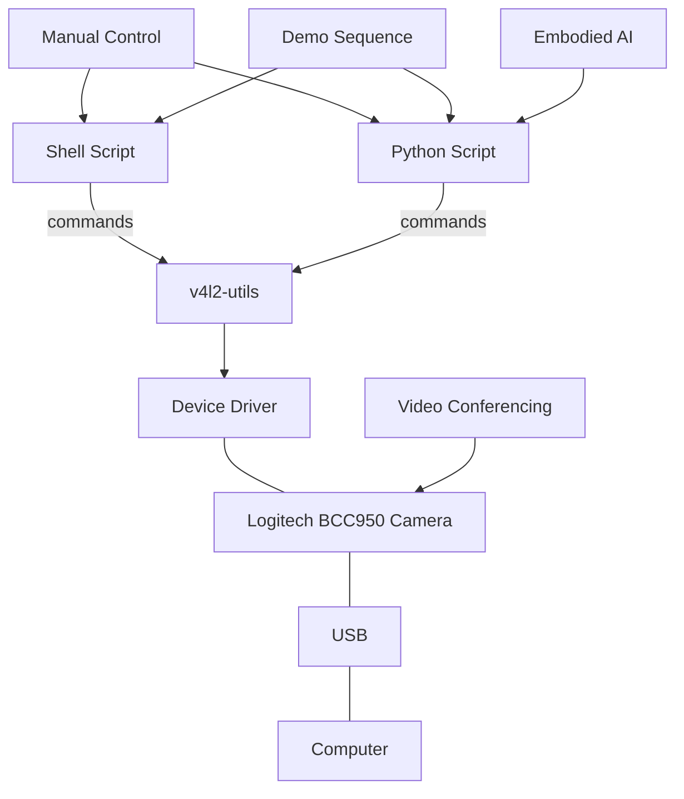
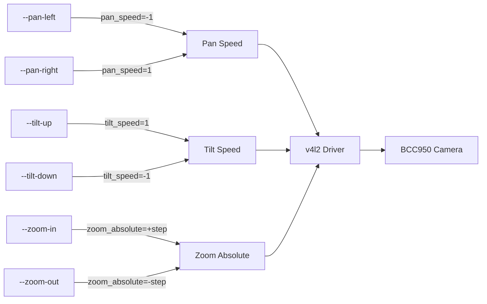
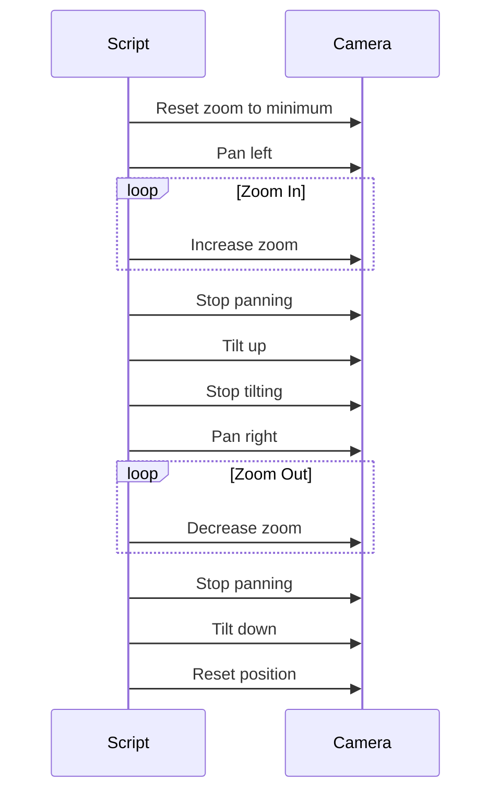
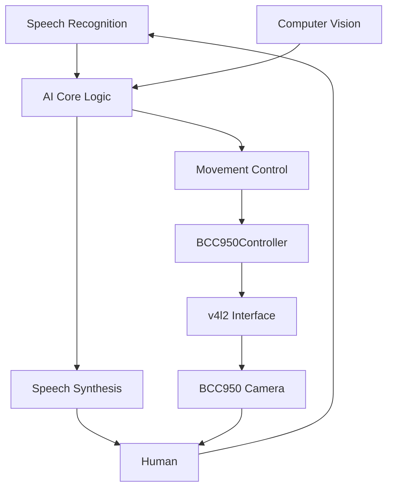

# Logitech BCC950 Camera Control


Control the Logitech BCC950 ConferenceCam's pan, tilt, and zoom functions via shell commands or Python in Linux.

## About the Logitech BCC950

The Logitech BCC950 ConferenceCam is a versatile videoconferencing device that combines excellent video quality with motorized pan, tilt, and zoom capabilities. This unique combination makes it not just an ordinary webcam, but a fully controllable camera that can be programmatically directed to look around a room.

### Key Features:

- **Full HD Video**: Delivers 1080p video quality at 30fps
- **Motorized Pan/Tilt**: 180° pan and tilt capabilities, controllable via remote or software
- **Digital Zoom**: Up to 4x zoom in SD (1.2x in HD) to focus on details
- **Built-in Audio**: Full-duplex speakerphone with noise cancellation and wideband audio
- **Omni-directional Microphone**: Clear audio pickup from up to 8 feet away
- **Remote Control**: Included remote control for manual adjustments
- **USB Plug-and-Play**: Simple connection to Linux, Windows, and macOS systems
- **Programmable Controls**: API access to pan, tilt, and zoom functions

## System Architecture



## Camera Movement Controls



## Installation & Setup

### Prerequisites

- Linux operating system
- v4l2-utils package (automatically installed by setup)
- Python 3.6+ (for Python script)

### Getting Started

```bash
# Clone this repository
git clone https://github.com/yourusername/logitech-bcc950-control.git
cd logitech-bcc950-control

# Make the scripts executable
chmod +x bcc950-control.sh
chmod +x bcc950_control.py

# Run setup (either script works)
./bcc950-control.sh --setup
# OR
./bcc950_control.py --setup
```

## Using the Shell Script

The shell script provides a simple command-line interface to control the camera:

```bash
# Pan the camera left
./bcc950-control.sh --pan-left

# Tilt the camera up
./bcc950-control.sh --tilt-up

# Zoom in
./bcc950-control.sh --zoom-in

# Run a demo sequence
./bcc950-control.sh --demo
```

## Using the Python Script

The Python script offers the same functionality with an object-oriented approach:

```bash
# Pan the camera left
./bcc950_control.py --pan-left

# Tilt the camera up
./bcc950_control.py --tilt-up

# Zoom in
./bcc950_control.py --zoom-in

# Run a demo sequence
./bcc950_control.py --demo
```

The Python script can also be imported into other Python applications:

```python
from bcc950_control import BCC950Controller

# Create controller instance
camera = BCC950Controller()

# Control camera
camera.pan_left()
camera.tilt_up()
camera.zoom_in()
camera.run_demo()
```

## Command Options

Both scripts support the following options:

- `--setup`: Install prerequisites and detect camera
- `--device DEVICE`: Specify camera device (default: auto-detected)
- `--list`: List available camera devices
- `--pan-left`: Pan camera left
- `--pan-right`: Pan camera right
- `--tilt-up`: Tilt camera up
- `--tilt-down`: Tilt camera down
- `--zoom-in`: Zoom camera in
- `--zoom-out`: Zoom camera out
- `--reset`: Reset camera to default position
- `--demo`: Run a demonstration sequence of camera movements
- `--info`: Show camera information and controls
- `--help`: Show help message

## Demo Sequence Flow



## Creating Embodied AI with the BCC950

The Logitech BCC950 is an excellent platform for creating embodied AI experiences. By combining its mechanical movement with AI capabilities, you can create an interactive presence that feels much more engaging than traditional voice assistants.

### Why It's Perfect for Embodied AI:

1. **Physical Movement**: The pan/tilt capabilities allow your AI to respond physically - turning to face someone when they speak, nodding in agreement, or looking around the room.

2. **Integrated Audio**: The built-in speakerphone and microphone mean your AI can hear and respond without additional hardware.

3. **Strong Presence**: The camera's eye-level positioning and motorized movement create a sense of presence that static webcams can't match.

4. **Programmable Control**: These scripts provide a foundation for integrating the camera's movement with AI systems.

### AI Integration Architecture



### Integration Ideas:

- **Voice Assistant Enhancement**: Connect with systems like ChatGPT, Rasa, or other conversational AI platforms and add physical responses.
  
- **Meeting Attendee**: Create an AI participant for meetings that can turn to face the active speaker.
  
- **Smart Home Hub**: Use as a central interface for your smart home, with the ability to look toward activity in different parts of a room.
  
- **Security Monitor**: Combine with computer vision to create a security system that can actively track motion.
  
- **Telepresence**: Enable remote workers to have better presence in meetings with automated tracking and movement.

## Contributing

Contributions are welcome! Feel free to submit pull requests or create issues for bugs and feature requests.

## License

This project is licensed under the MIT License - see the LICENSE file for details.
